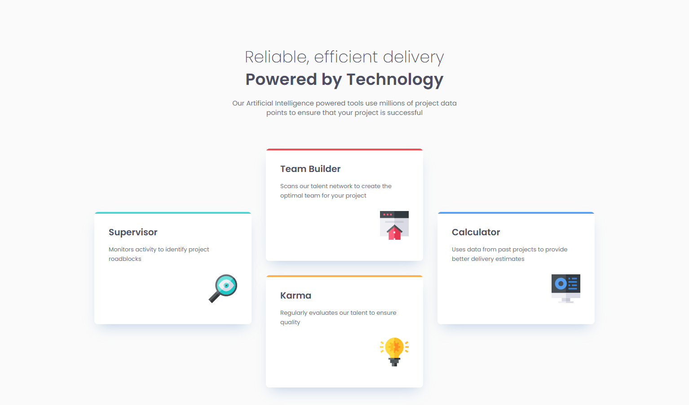

# Frontend Mentor - Four card feature section solution

This is a solution to the [Four card feature section challenge on Frontend Mentor](https://www.frontendmentor.io/challenges/four-card-feature-section-weK1eFYK). Frontend Mentor challenges help you improve your coding skills by building realistic projects. 

## Table of contents

- [Overview](#overview)
  - [The challenge](#the-challenge)
  - [Screenshot](#screenshot)
  - [Links](#links)
- [My process](#my-process)
  - [Built with](#built-with)
  - [What I learned](#what-i-learned)
  - [Useful resources](#useful-resources)

**Note: Delete this note and update the table of contents based on what sections you keep.**

## Overview

### The challenge

Users should be able to:

- View the optimal layout for the site depending on their device's screen size

### Screenshot

### Links

- Solution URL: [GitHub](https://github.com/oridr/fe-mentor/tree/main/four-card-feature-section)
- Live Site URL: [GitHub Pages](https://oridr.github.io/fe-mentor/four-card-feature-section/)

## My process

### Built with

- Fluid design
- Media queries with CSS Grid
- Semantic HTML5 markup
- CSS custom properties
- Mobile-first workflow

### What I learned

Using CSS media queries to update grid area to change layout

### Useful resources

- [UTOPIA Fluid Calculators](https://utopia.fyi/) - generate fluid font sizes and spacing using clamp
- [A Modern CSS Reset](https://www.joshwcomeau.com/css/custom-css-reset/) - modern and simple CSS reset
