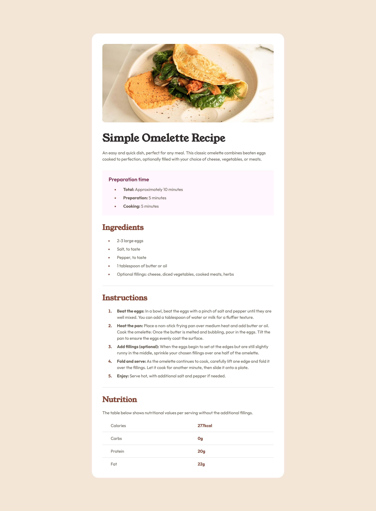

# Frontend Mentor - Recipe page solution

This is a solution to the [Recipe page challenge on Frontend Mentor](https://www.frontendmentor.io/challenges/recipe-page-KiTsR8QQKm). Frontend Mentor challenges help you improve your coding skills by building realistic projects. 

## Table of contents

- [Overview](#overview)
  - [Screenshot](#screenshot)
  - [Links](#links)
- [My process](#my-process)
  - [Built with](#built-with)
  - [What I learned](#what-i-learned)
  - [Useful resources](#useful-resources)

## Overview

### Screenshot



### Links

- Solution URL: [Github](https://github.com/oridr/fe-mentor/tree/main/recipe-page-main)
- Live Site URL: [Github Pages](https://oridr.github.io/fe-mentor/recipe-page-main/)

## My process

### Built with

- CSS ```@layer```
- CSS ```clamp```
- Semantic HTML5 markup
- CSS custom properties
- CSS Grid
- Mobile-first workflow

### What I learned

* CSS clamp and fluid font size and spacing
* Using the @layer to control specificity
* Correctly working with ```<header>```, ```<section>```, headings

### Useful resources

- [@layer](https://developer.mozilla.org/en-US/docs/Web/CSS/@layer) - working with CSS layers
- [UTOPIA Fluid Calculators](https://utopia.fyi/) - generate fluid font sizes and spacing using clamp 
